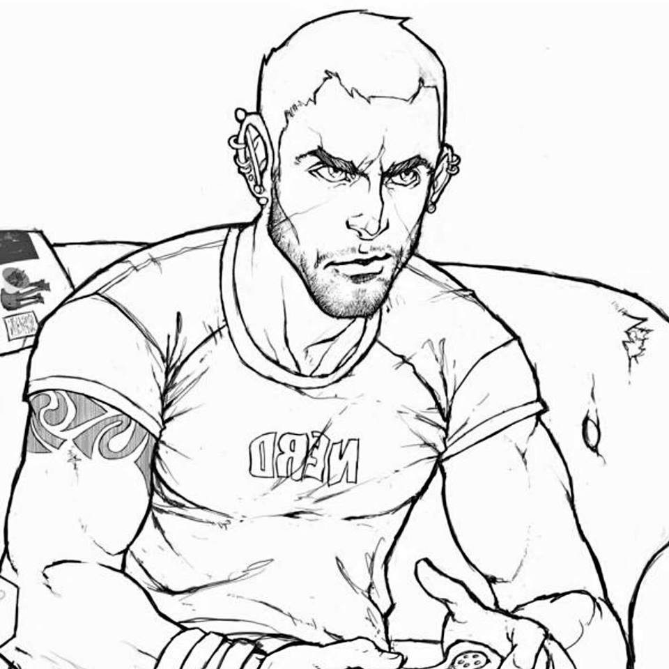

# Toucans-Team-4

# Introduction

Welcome Ladies and Gentelmen to our learning project for the Chingu Cohort Voyage 5.

For this Voyage we have decided to recreate a complete clone/copy of the TickyBot landing page.

Even though this is a clone/copy, we will still attempt to add our own personal flavor to it.

# Links

The original landing page can be found at: https://tickybott.herokuapp.com/

Our clone version can be found at: https://github.com/chingu-voyage5/Toucans-Team-4

# Documentation

The main stacks that were used to complete this project was HTML/CSS & JavaScript.

At the same time, we also decided to sprinkle in a few other things into the project to help make everything a bit more organized. The extra sprinkles that we used were: Node.js, Gulp, PostCSS, BrowserSync and a few others.

# Team Members

The team consits of three highly motivated and skilled learners each with different sets of skills that they contributed to the completion of this project. 

  
  Project Manager &amp; Developer: Jay Lee (https://github.com/dreampoetlee)

  
  Developer: Emmilie Estabillo (https://github.com/emestabillo)

  
  Developer: Eduardo Luiz Schilling (https://github.com/elschilling)

